<p align="center">
  
</p>

<h1 align="center">Getting Started with Docker Containers</h1>

<p align="center"><b>Package your app once, run it anywhere.</b> A hands-on introduction to Docker — four worked examples, best-practice guides, and the commands you'll actually use.</p>

<p align="center">
  
  
  
  <a href="LICENSE"></a>
</p>

---

## The idea

A container bundles your app with everything it needs to run — code, runtime, libraries — into one **immutable image**. Build it once with a `Dockerfile`, and it runs the same on your laptop, a server, or the cloud. No more "works on my machine."

## Four examples, one path

<p align="center">
  
</p>

| Example | What it teaches |
|---|---|
| [`node-app`](examples/node-app/) | Containerize a Node app — your first Dockerfile |
| [`python-app`](examples/python-app/) | The same idea in another runtime |
| [`multi-stage`](examples/multi-stage/) | Build then slim the image — smaller and safer |
| [`docker-compose`](examples/docker-compose/) | Run an app and a database together |

Each folder has its own README. Pick one and `docker build` it.

## Quick start

```bash
git clone https://github.com/ry-ops/getting-started-docker-containers.git
cd getting-started-docker-containers/examples/node-app

docker build -t my-app .
docker run -p 3000:3000 my-app
```

## Commands you'll use

```bash
docker build -t name .          # build an image
docker run -p 8080:80 name      # run a container
docker ps                       # running containers
docker logs <id>                # view logs
docker exec -it <id> sh         # shell into a container
docker compose up               # start a multi-container app
```

## Go deeper

- [DOCKERFILE-BEST-PRACTICES.md](documentation/DOCKERFILE-BEST-PRACTICES.md)
- [OPTIMIZATION.md](documentation/OPTIMIZATION.md) — smaller, faster images
- [DOCKER-COMPOSE.md](documentation/DOCKER-COMPOSE.md)

## License

MIT. See [LICENSE](LICENSE).

<!-- org-footer -->
---

<p align="center"><sub>Part of <a href="https://github.com/ry-ops">ry-ops</a> · building the pipes between infrastructure, automation, and observability · built by <a href="https://github.com/ry-ops">ry-ops</a></sub></p>
